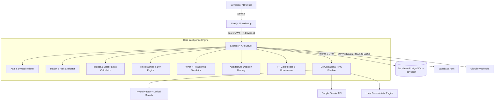

# ForgeMind

> **ForgeMind helps developers understand what a code change does to the architecture — not just what the code does.**

ForgeMind is an architecture intelligence and developer learning platform for understanding software repositories and managing the impact of change. By coupling AST symbol indexing, dependency graph generation, and hybrid vector retrieval with contextual AI reasoning, ForgeMind converts raw source code into an active, queryable architectural graph.

---

## 📌 What is ForgeMind?

### The Problem

As software repositories grow in scale and age:

- **Architectural context decays**: Engineers lose sight of system boundaries, circular dependencies, and high-risk hotspots.
- **Change impact is uncertain**: A minor pull request in one file can cause unexpected ripple effects across downstream services.
- **Architectural drift accumulates**: Institutional memory of why architectural decisions were made disappears over time.
- **Onboarding is slow and manual**: New developers spend weeks manually reading files instead of understanding the system's structural flow.

### The Solution

ForgeMind analyzes repository structure at the Abstract Syntax Tree (AST) level to build an **Architecture Graph**. It continuously evaluates health score metrics, predicts change blast radius, tracks historical drift, simulates refactoring outcomes, enforces policy governance, and provides evidence-grounded AI codebase assistance.

---

## 🔄 The ForgeMind Loop

ForgeMind provides an integrated, continuous workflow for repository intelligence:

```
Understand ──► Explain ──► Measure ──► Trace ──► Simulate ──► Govern ──► Learn
```

1. **Understand**: Parse source code into AST symbols, file dependencies, and structural boundaries.
2. **Explain**: Visualize interactive component graphs and interrogate codebase architecture using natural language.
3. **Measure**: Calculate objective health scores, identify circular cycles, layer violations, and hotspots.
4. **Trace**: Track historical architectural evolution and decision memory across commits and PRs.
5. **Simulate**: Model proposed refactoring changes and evaluate blast radius prior to code modification.
6. **Govern**: Enforce policy-based architectural quality gates on pull requests via GitHub webhooks.
7. **Learn**: Generate architecture-aware onboarding blueprints and guided codebase tours for developers.

---

## 🏗️ Core Capabilities

### 1. Repository Code Intelligence

- **AST-Based Indexing**: Extracts top-level classes, functions, interfaces, types, and variables.
- **File Dependency Graphing**: Analyzes local imports, export bindings, and external package references.
- **Multi-Language Support**: Structural indexing for TypeScript, JavaScript, Python, Go, Java, and monorepo configurations.

### 2. Architecture Graph & Topology

- **Interactive Component Graphs**: Node-and-edge visualization of system topology.
- **Node Inspection**: Deep-dive into specific files or symbols with fan-in/fan-out metrics.
- **Contextual Traversal**: One-click navigation from any graph node to health findings, impact analysis, or decision history.

### 3. Architecture Health & Risk Evaluation

- **Health Scoring**: 0–100 weighted health index with letter grades (A–F).
- **Finding Categories**: Automatic detection of circular dependency cycles, architectural layer violations, maintainability hotspots, and orphaned exports.
- **Actionable Remediation**: AI-assisted refactoring plans with blast radius estimations and verification checklists.

### 4. Change Intelligence & Impact Analysis

- **Blast Radius Calculation**: Identifies direct and transitive files affected by a proposed file or symbol change.
- **Risk Level Assessment**: Categorizes change risk (Low, Medium, High, Critical) based on dependency depth.
- **Contextual Action Hints**: Direct triggers to simulate refactoring or record architecture decisions.

### 5. Architecture Drift & Time Machine

- **Historical Snapshot Comparison**: Compare repository health and topology across different commits and historical milestones.
- **Drift Detection**: Identify degrading architectural components and emerging cycle bottlenecks over time.

### 6. What-If Architecture Simulation

- **Non-Destructive Refactoring Models**: Simulate node deletions, dependency additions, or structural reorganizations.
- **Consequence Prediction**: Preview estimated health score deltas and new circular cycles before changing code.

### 7. Architecture Decision Memory

- **Evidence-Grounded ADR Records**: Captures historical architectural decisions directly linked to PRs and commits.
- **AI Synthesis**: Summarizes commit messages, pull request descriptions, and changed paths into clear architectural rationales.
- **Human Confirmation Control**: Supports human confirmation (`Confirmed` vs `Mined`) for governance tracking.

### 8. PR Governance & Gatekeeper

- **Policy-Based Quality Gates**: Configurable rules for maximum allowed score degradation, new critical findings, or new circular cycles.
- **GitHub Webhook Integration**: Automated PR status check reporting based on incoming pull request payload analysis.

### 9. Developer Onboarding & Learning

- **Architecture-Aware Blueprints**: Auto-generated onboarding walkthroughs highlighting key architectural entry points.
- **Guided Code Tours**: Step-by-step navigation through critical execution paths.
- **Exportable Documentation**: Export onboarding blueprints to Markdown for team sharing.

---

## 🤖 AI Assistant (Conversational RAG)

ForgeMind features a repository-scoped, evidence-grounded Conversational AI Assistant designed to answer questions about system structure, code flow, and architectural patterns.

### RAG Architecture Pipeline

```
Question Input
      │
      ▼
Contextual Query Reformulation  (bounded by 10 conversation turns)
      │
      ▼
Query Intent Analysis           (FLOW, ARCHITECTURE, DEPENDENCIES, AUTH)
      │
      ▼
Hybrid Retrieval Engine         (pgvector HNSW Cosine + ILIKE Lexical)
      │
      ▼
Reciprocal Rank Fusion (RRF) & Cross-Encoder Reranking
      │
      ▼
Structural Overview Injection   (Directories, languages, AST symbols)
      │
      ▼
Grounded LLM Prompting           (System prompt with [SOURCE N] line ranges)
      │
      ▼
Dual-Mode Synthesis             (Gemini Cloud API  OR  Local Deterministic)
      │
      ▼
Source Line Citations           (File path + exact line attribution)
```

### Dual-Mode Execution

- **Cloud Mode (Google Gemini)**: Activated when `GEMINI_API_KEY` is configured. Uses `gemini-2.5-flash` with native system instructions and multi-turn conversation tracking (`generateConversationalAnswer`).
- **Offline Fallback Mode (Local Deterministic)**: Active when no cloud API keys are present. Uses a zero-dependency TypeScript synthesis engine (`LocalDeterministicLLMProvider`) to analyze retrieved source blocks, filter out non-implementation code, enforce technology-specificity gates (refusing un-implemented technologies like Redis/Kafka), and format grounded responses with evidence quality ratings (`Direct` vs `Supporting`).

### Citation Grounding & Transparency

Every response includes **Source Citations** specifying exact file paths and line ranges (`L14–L48`). The UI displays match confidence percentages and allows one-click navigation to inspect the cited code in the file viewer. Responses clearly indicate the active provider (`via gemini` or `via local-deterministic`).

---

## 🏛️ System Architecture



---

## 🛠️ Tech Stack

- **Frontend**: Next.js 15 (App Router), React 19, TailwindCSS v4, TypeScript
- **Backend**: Express 4, Node.js (>=24.0.0), TypeScript, Prisma 6 ORM
- **Database & Auth**: Supabase PostgreSQL, `pgvector` extension, Supabase Auth
- **AI & RAG**: Google Gemini API (`gemini-2.5-flash`), HNSW Vector Embeddings, Local Deterministic Engine
- **Tooling**: Turborepo, pnpm 9, Docker, ESLint, Prettier, Husky, lint-staged

---

## 📁 Repository Structure

```
forgemind/
├── apps/
│   ├── web/                        # Next.js 15 frontend application
│   └── api/                        # Express 4 API server & RAG pipeline
├── packages/
│   ├── ui/                         # @forgemind/ui — Shared UI components
│   ├── shared/                     # @forgemind/shared — Shared utilities & constants
│   ├── types/                      # @forgemind/types — TypeScript interfaces
│   ├── typescript-config/          # @forgemind/typescript-config — Shared tsconfigs
│   └── eslint-config/              # @forgemind/eslint-config — Shared ESLint rules
├── docker/                         # Production multi-stage Dockerfiles
├── scripts/                        # Bootstrap & cleanup scripts
├── docker-compose.yml              # Local development stack
├── turbo.json                      # Turborepo task pipeline
├── pnpm-workspace.yaml             # pnpm workspace configuration
└── .env.example                    # Environment variable template
```

---

## 🚀 Getting Started

### Prerequisites

| Tool       | Minimum Version                             |
| ---------- | ------------------------------------------- |
| Node.js    | `>= 24.0.0`                                 |
| pnpm       | `>= 9.0.0`                                  |
| PostgreSQL | PostgreSQL 16 with `pgvector` (or Supabase) |

### Developer Setup

```bash
# 1. Clone the repository
git clone https://github.com/Tharan-x/forgemind.git
cd forgemind

# 2. Run developer bootstrap script
node scripts/setup.js

# 3. Configure environment variables
cp .env.example .env

# 4. Generate Prisma Client
pnpm --filter @forgemind/api db:generate

# 5. Push database schema to local/dev PostgreSQL
pnpm --filter @forgemind/api db:push

# 6. Start all applications in development mode
pnpm dev
```

Applications will be available at:

- **Web App**: `http://localhost:3001` (or `http://localhost:3000`)
- **API Server**: `http://localhost:4000/api/v1`
- **API Health Check**: `http://localhost:4000/api/v1/health`

---

## 🔧 Environment Variables

Configure `.env` using `.env.example` as a baseline:

| Variable                        | Scope     | Required / Optional | Purpose                                                     |
| ------------------------------- | --------- | ------------------- | ----------------------------------------------------------- |
| `NODE_ENV`                      | API / Web | Required            | Environment mode (`development` / `test` / `production`)    |
| `API_PORT`                      | API       | Optional            | Express server port (default: `4000`)                       |
| `DATABASE_URL`                  | API       | Required            | Connection pooler PostgreSQL connection string              |
| `DIRECT_URL`                    | API       | Required            | Direct PostgreSQL connection string (for Prisma migrations) |
| `SUPABASE_URL`                  | API / Web | Required            | Supabase project URL                                        |
| `SUPABASE_ANON_KEY`             | API / Web | Required            | Supabase anonymous public API key                           |
| `SUPABASE_SERVICE_ROLE_KEY`     | API       | Required            | Supabase service role secret key (server-side only)         |
| `NEXT_PUBLIC_API_URL`           | Web       | Required            | Base URL of the API server for frontend requests            |
| `NEXT_PUBLIC_SUPABASE_URL`      | Web       | Required            | Client-side Supabase project URL                            |
| `NEXT_PUBLIC_SUPABASE_ANON_KEY` | Web       | Required            | Client-side Supabase anonymous API key                      |
| `ENCRYPTION_SECRET`             | API       | Required in Prod    | 32-byte hex secret for AES-256-GCM token encryption         |
| `GITHUB_WEBHOOK_SECRET`         | API       | Required in Prod    | Secret for GitHub webhook HMAC-SHA256 verification          |
| `ALLOWED_ORIGINS`               | API       | Required in Prod    | Comma-separated CORS allowed origins                        |
| `GEMINI_API_KEY`                | API       | Optional            | Google Gemini API key for cloud LLM & vector embeddings     |
| `GEMINI_MODEL`                  | API       | Optional            | Model selection (default: `gemini-2.5-flash`)               |

---

## 🧪 Testing & Verification

```bash
# Run TypeScript type-check across all workspace packages
pnpm type-check

# Run ESLint across all workspace packages
pnpm lint

# Check Prettier formatting
pnpm format:check

# Run Web test suite
pnpm --filter @forgemind/web test

# Run API test suite
pnpm --filter @forgemind/api test

# Run workspace build validation
pnpm build
```

---

## 🔒 Security & Authentication

- **Authentication**: Powered by Supabase Auth (Email/Password, GitHub OAuth, Google OAuth) returning Bearer JWTs.
- **Device Session Hardening**: Server-side device authorization requiring `X-Device-Id` headers on protected routes, supporting persistent trusted devices and active revocation enforcement.
- **Token Security**: GitHub access tokens are encrypted at rest using AES-256-GCM authenticated encryption (`ENCRYPTION_SECRET`).
- **Webhook Protection**: Incoming GitHub webhooks are verified via HMAC-SHA256 signatures (`X-Hub-Signature-256`).

---

## 📄 Product Status

ForgeMind V1 core features are **implemented and frozen**. All core components—including AST code parsing, interactive architecture graphs, health evaluation, impact analysis, time machine drift tracking, what-if simulations, decision memory, PR gatekeeper policies, and conversational RAG—are fully operational and validated by integration test suites.

---

## 📜 License

Distributed under the MIT License. See [LICENSE](./LICENSE) for details.
